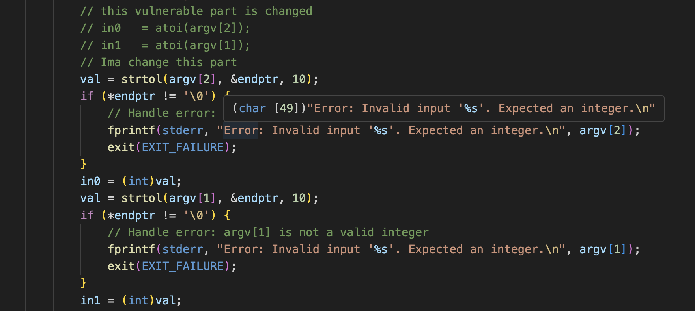
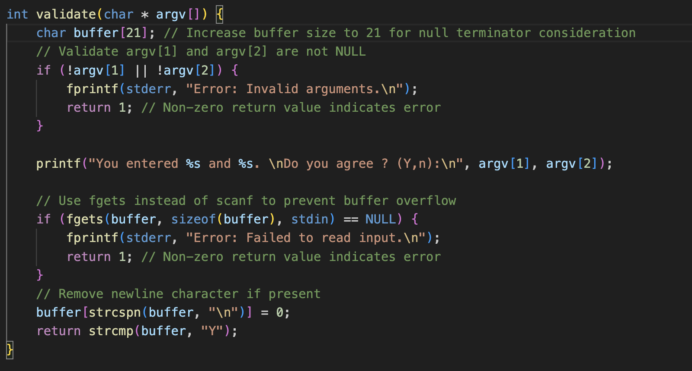
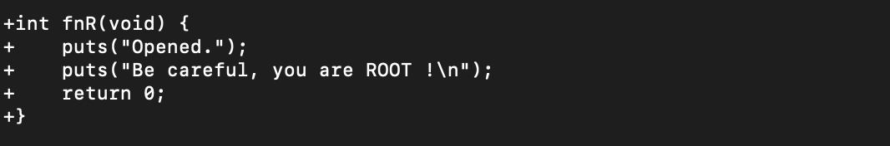

<h3>Introduction</h3>

As a C developer in the home automation software security division, my task involves enhancing the security of an existing program while maintaining its legacy version, including its bugs, for demonstration purposes.
The approach adopted for this task includes a thorough analysis of the program's source code, identification of potential security threats (such as buffer overflow vulnerabilities), and strategic planning to enhance the program's resilience against attacks, particularly fuzzing attacks. The process involves both static and dynamic analysis techniques, rigorous testing, and careful documentation of each step taken to improve the program's security profile.

# Analysis protocol

To conduct a thorough analysis of the protocol, I utilized the following methodologies and techniques :- 

<ul>
<h5>Threat Identification</h5>
<b>Buffer Overflow Vulnerability: </b>
<li>
Identified in the validate function due to the unsafe use of scanf with a fixed-size buffer.
</li>
<li>Potential for arbitrary code execution or crashing the program.</li>
<b>Input Validation Issues:</b>

<li>Lack of robust validation in the main function and validate function, leading to potential misuse or unexpected behavior.</li>
<b>Legacy Code Security Flaws:</b>

<li>Older versions of the program may contain outdated practices and vulnerabilities</li>
</ul>

<ul>
<h5>Addressing Threats</h5>
<b>Buffer Overflow Mitigation:</b>
<li>Replace scanf with fgets and add buffer size checks.</li>
<li>Implement stack protection techniques and use compiler flags that help mitigate buffer overflows.</li>
<b>Improved Input Validation:</b>
<li>Implement thorough checks for command-line arguments.
</li>
<li>Ensure `validate` function handles all possible input scenarios safely.
</li>
<b>Legacy Code Management:</b>
<li>Identify and document the legacy bugs that need to be preserved.
</li>
<li>Isolate legacy features to maintain functionality without compromising new code security.
</li>
</ul>
<ul>
<h5>Assessment Method</h5>
<b>Static Analysis:</b>
<li> To review the codebase and binary files I've used Ghidra tool which is a software reverse engineering (SRE) framework developed by the National Security Agency (NSA). This tool is particularly adept at analyzing both the source code and the compiled binaries, providing a comprehensive understanding of the program's functionality and potential vulnerabilities </li>
<b>Debugging Tool:</b>
<li>GDB is a powerful, versatile debugger for the GNU operating system, used for debugging programs written in C, C++, and other languages.</li>
<b>Documentation and Reporting:</b>

<li>Maintain detailed documentation of all findings and fixes.</li>
<li>Preparing a patch file; the rationale behind each fix, and the approach to comparing legacy features.</li>
</ul>

# Legacy Options

A subsequent task is the identification and appropriate configuration of compiler and linker flags. This report focuses on the specific task of determining the legacy options for LEGCFLAGS (Legacy Compiler Flags) and LEGLDFLAGS (Legacy Linker Flags) for a home automation software project. This task is integral to ensuring that the updated version of the software remains compatible with legacy systems while incorporating necessary security and functional enhancements.

<b>Compiler Flags (LEGCFLAGS):</b>

Compiler flags are crucial in controlling the compilation process of a program. They can dictate various aspects like optimization levels, debugging information, and compatibility with different standards or architectures.
In the context of legacy systems, selecting the right compiler flags is essential to maintain compatibility with older codebases and hardware.

<b>Linker Flags (LEGLDFLAGS):</b>

Linker flags play a significant role in the later stages of the build process, where they influence how different compiled parts of the program are combined.
For legacy systems, linker flags must be chosen to ensure that the final executable can run on older architectures and interact correctly with legacy libraries and environments.

<b>Proposed Legacy Options</b>
<i>For LEGCFLAGS :- </i>
<ul>
<li>
<b>-D_FORTIFY_SOURCE=2</b>

Purpose: This macro provides compile-time and run-time checks for certain libc functions known to be vulnerable to buffer overflow attacks, such as strcpy, sprintf, etc.

When set to 2, the compiler replaces calls to vulnerable functions with safer variants (if available) and performs additional checks. For example, strcpy() might be replaced with __strcpy_chk() which includes an additional size parameter to prevent buffer overflows.

Impact on Security: It can significantly enhance the security of a program by catching buffer overflows.

</li>
<li>
<b>-pie and -fPIE</b>

Purpose: These flags are used to create a Position-Independent Executable, which is an important feature for implementing Address Space Layout Randomization (ASLR).

-fPIE: This flag generates position-independent code for the executable, meaning the code can run at any address without modification.

-pie: This flag tells the linker to create a position-independent executable.

Impact on Security: ASLR makes it more difficult for an attacker to predict the location of code and data in memory, thereby mitigating the risk of certain types of attacks, like return-to-libc attacks.

</li>
<li>
<b>-ftrapv</b>

Purpose: This flag is used to catch integer overflows, which can lead to security vulnerabilities.

When an integer overflow occurs, instead of wrapping around, the program will generate a runtime error or trap, which can then be handled appropriately.

Impact on Security: It helps in identifying and preventing exploits that rely on integer overflow vulnerabilities.

</li>
</ul>

<i>For LEGDFLAGS :- </i>
<ul>
<li>
<b>-static</b>

The -static flag is used during the linking stage of the compilation process to create a statically linked executable

When you use the -static flag, the linker embeds all the code from the libraries directly into the final executable. This means that the executable contains all the library functions it uses, and it doesn't need to look for those libraries at runtime

</li>
<li>
<b>-shared</b>

The -shared flag is used to create a shared object, often as part of building a dynamic library. Here's a breakdown:

When compiling with -shared, the linker produces a shared object file (.so in Linux, .dll in Windows). This file contains code that can be loaded and linked at runtime by different executables.

</li>
</ul>

# Legacy options Analysis
LEGCFLAGS
<li>To include</li>
-D_FORTIFY_SOURCE=2:

Reason: Enhances stack protection against buffer overflows.
-D_FORTIFY_SOURCE=2. Provides compile-time and run-time checks to prevent buffer overflows.

``-fPIE or -fPIC:``

Reason: Necessary for Position-Independent Code, which is important for Address Space Layout Randomization (ASLR).

<li>Not to include</li>
-fno-stack-protector:

Reason for Removal: Disables stack protection, making the program vulnerable to buffer overflow attacks.
-std=c90 or -ansi:

Reason for Removal: Older language standards may not support modern security features.
-O3:

Reason for Removal: Aggressive optimization can sometimes obscure code behavior and security vulnerabilities.

LEGDFLAGS
<li>To include</li>

-Wl,-z,relro:
Reason: Makes certain sections of the memory read-only, increasing protection against certain exploits.

-Wl,-z,now:
Reason: Forces the resolution of all symbols at program startup, reducing the risk of certain types of attacks.

-Wl,--as-needed:
Reason: Links only the libraries that are actually used, reducing the attack surface.

<li>Not to include</li>

-static:
Reason for Removal: Creates statically linked executables which can be larger and miss out on updates to shared libraries.

-Wl,--no-as-needed:
Reason for Removal: Forces linking of all specified libraries, potentially increasing the attack surface.

-Wl,--whole-archive:
Reason for Removal: Unless specifically required, this can unnecessarily increase the size of the executable and include unused code, which might have vulnerabilities.

# Problems in source file

After a thorough analysis of the source code for the home automation project I have found the following potential vulnerabities that can be exploited by an attacker.
<h4>Problem 1: Use of `atoi` function</h4>
<code>
in0 = atoi(argv[2]);
in1 = atoi(argv[1]);
</code>

<b>Problem:</b> The atoi function does not handle non-integer inputs or integer overflows well. It can lead to undefined behavior if the input is not a valid integer.

<b>Solution:</b> 
We can replace `atoi` it with `strtol`, a function that provides better error checking and handles non-integer inputs and integer overflows more gracefully

<h4>Buffer Overflow Vulnerability in validate Function</h4>
<code>
char buffer[20];
scanf("%s", buffer);
</code>

Problem: The use of scanf with %s to read into a fixed-size buffer (buffer[20]) without specifying a limit can lead to a buffer overflow if the input exceeds 19 characters (leaving space for the null terminator).

Solution: Use fgets or specify a maximum field width in scanf (e.g., scanf("%19s", buffer)).

<h4>Lack of Input Validation in validate Function</h4>
<code>
printf("You entered %s and %s. \nDo you agree ? (Y,n):\n", argv[1], argv[2]);
</code>

Problem: There is no validation to ensure that argv[1] and argv[2] are not NULL before using them in printf, which could lead to a segmentation fault if argv[1] or argv[2] are NULL.
Solution: Add checks to ensure argv[1] and argv[2] are not NULL

<h4>Unused program </h4>
<code>
int fnR(void) {
    puts("Opened.");
    puts("Be careful, you are ROOT !\n");
    return 0;
}
</code>

Problem: The above function gives root access to the user as it says and is not being used anywhere in the code. This can be reversed engineer and tried to call to gain root access of the program
Solution: The best way is to delete this part of code.

# Patch file summary
In the patch file I have changed the following in ``main.c``

- Replaced the ``atoi`` function with ``strol``
Function strtol: Converts a string to a long int. It requires the string to be converted, a char pointer (which points to the first non-integer character after the number in the string), and the base for conversion (10 for decimal).
Endptr is used to determine whether the entire string was a valid integer. If *endptr is not '0,' this indicates that the string contains non-numeric characters.
Casting: The returned long value is converted to an int. Be wary of potential overflows and underflows.
Error Handling: The code now contains error messages and exits if the input is not an integer.

This fix ensures that the inputs are valid integers and deals with the cases where they are not.

- Fixed the Buffer Overflow issue in ``functions.c`` file
The validate function is modified and now handles issues like buffer overflow by changing the buffer size to 21 from 20 considering the null character. Checking the arguments at early stage for null arguments. The ``scanf`` is changed to ``fgets`` which is safer as it limits the size readability of buffer based on the input. Error handling if the ``fgets`` function fails i.e. returns NULL and error message is printed to ``stderr`` returning 1 which indicates an error.

This fix ensures that there is no bufferoverflow vulnerability in the code that can be exploited by the attacker.

- Deleted the ``fnR`` function to not give any third party a chance to get root access of the program and potentially misuse the unethically gained priviledges.

- Markdown File:-Added the necessary``LEGCFLAGS`` and ``LEGDFLAGS`` :
``LEGCFLAGS  = -D_FORTIFY_SOURCE=2 -fPIE``
``LEGLDFLAGS = -Wl -z --as-needed``

#Conclusion
In summary, the review and enhancement of the door-locker project have been successfully completed. Key vulnerabilities within the code, particularly related to buffer overflows and input validation, have been identified and effectively remediated. The implementation of updated legacy compiler and linker flags has significantly bolstered the security posture of the application while maintaining compatibility with legacy systems.
The patches applied not only address the immediate security concerns, but also lay the groundwork for future more secure and maintainable code. This proactive approach to software security is consistent with our commitment to providing solid and dependable home automation solutions.
I am confident that these enhancements will contribute to the overall resilience and performance of our product, aligning with our organizational standards for quality and security. I am available to discuss any further details or to proceed with additional improvements as deemed necessary.